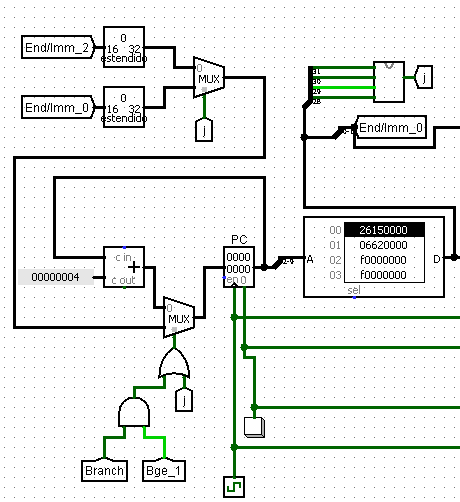
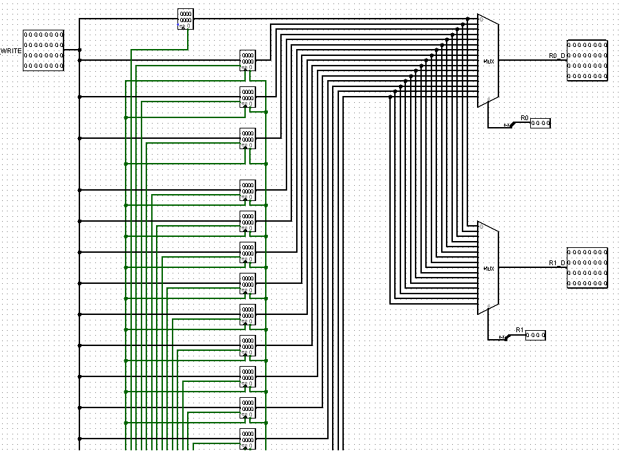
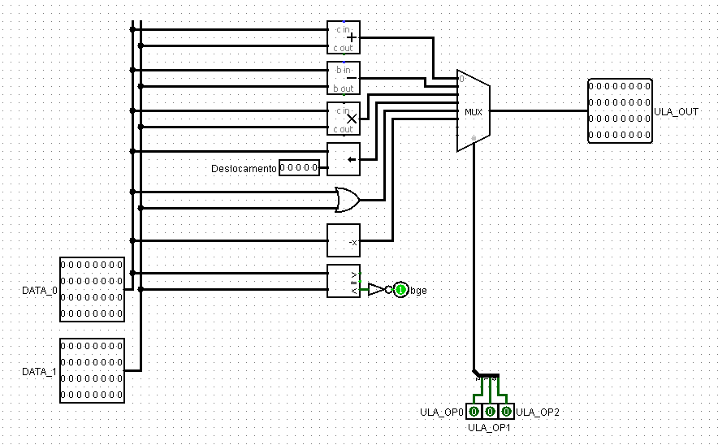
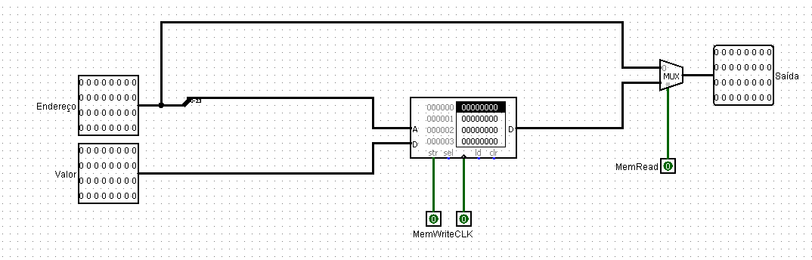

# MeuProcessador----Arq.-Comp

# Processador Pipelined para o Produto de Matrizes 3x3

## Introdução

O objetivo deste relatório é documentar a implementação de um processador pipelined para realizar o produto de matrizes 3x3. O processador foi projetado utilizando os fundamentos do pipelining e implementado no software Logisim. O código para controlar o processador foi escrito em linguagem assembly MIPS.

## Visão Geral do Pipelining

O pipelining é uma técnica de processamento que permite que múltiplas instruções sejam executadas simultaneamente em diferentes estágios do pipeline. Isso aumenta significativamente a taxa de processamento e melhora a eficiência do processador.

O pipeline é dividido em estágios, onde cada estágio executa uma parte específica da instrução. As instruções são então passadas de um estágio para o próximo em cada ciclo de clock. Isso permite que várias instruções estejam em diferentes estágios de execução simultaneamente, aumentando a vazão do processador.

## Arquitetura do Processador

O processador implementado é composto pelos seguintes componentes:

### Memória de Instruções

Armazena o código assembly MIPS a ser executado, fornecendo instruções durante o estágio de busca (Fetch) do pipeline.

### Banco de Registradores

Conjunto de registradores de propósito geral que armazenam dados temporários durante a execução do programa.

### Unidade Lógica e Aritmética (ULA)

Realiza operações lógicas e aritméticas nos dados durante o estágio de execução (Execute) do pipeline.

### Memória de Dados

Armazena dados utilizados pelo programa e é acessada durante instruções que envolvem acesso à memória.

No que diz respeito à estrutura de pipelining, este processador segue uma arquitetura pipeline clássica, dividida em cinco estágios principais:

1. **Estágio de Busca (Fetch)**:
   - Neste estágio, a próxima instrução a ser executada é buscada na memória de instruções. A unidade de controle coordena a busca e recuperação da instrução.

2. **Estágio de Decodificação (Decode)**:
   - A instrução buscada é decodificada neste estágio. Os campos da instrução são identificados e os operandos são lidos dos registradores correspondentes.

3. **Estágio de Execução (Execute)**:
   - Aqui, a operação especificada pela instrução é executada. Isso pode incluir operações aritméticas, lógicas ou de controle de fluxo, dependendo do tipo de instrução.

4. **Estágio de Acesso à Memória (Memory Access)**:
   - Se a instrução envolver acesso à memória, como leitura ou escrita, este estágio será ativado. Os endereços de memória necessários são calculados e a leitura ou escrita ocorre.

5. **Estágio de Escrita de Resultados (Write-back)**:
   - O resultado da instrução é escrito de volta no registrador de destino neste estágio. Isso conclui a execução da instrução e prepara o processador para processar a próxima instrução no pipeline.

A arquitetura pipeline permite que múltiplas instruções sejam executadas simultaneamente em diferentes estágios do pipeline, aumentando assim a vazão de instruções executadas do processador.

## Implementação do Produto de Matrizes 3x3

O código assembly MIPS foi desenvolvido para realizar o produto de matrizes 3x3. O algoritmo implementa a multiplicação de matrizes, seguindo o algoritmo tradicional, implementado no programa assembly MIPS anexado no pacote de códigos deste mesmo repositório.

## Instruções Implementadas

As seguintes instruções foram implementadas no processador:

1. `add`: Adiciona dois registradores e armazena o resultado em um terceiro registrador.
2. `sub`: Subtrai dois registradores e armazena o resultado em um terceiro registrador.
3. `mul`: Multiplica os conteúdos de dois registradores e armazena o resultado em um terceiro registrador.
4. `sll`: Desloca em uma determinada quantidade de casas um número binário. É equivalente a multiplicar um valor decimal por uma potência de 2 determinada na instrução.
5. `move`: Move o valor presente em um registrador para outro.
6. `not`: Negação bit a bit, usada para obter o complemento de 2 de um número binário.
7. `lw`: Carrega uma palavra da memória de dados para um registrador.
8. `sw`: Armazena uma palavra de um registrador na memória de dados.
9. `j`: Salta incondicionalmente, na memória de instruções, para o endereço fornecido.
10. `addi`: Adiciona o valor contido em um registrador com um valor imediato (constante) fornecido na instrução.
11. `li`: Carrega um valor imediato (constante) em um registrador.
12. `beq`: Compara os valores de dois registradores A e B, respectivamente, e verifica se A é maior ou igual a B.
13. `bubble`: Instrução de atraso, que não executa nada. É utilizada para fazer com que o processador fique ocioso e não realize mais operações, enquanto outras instruções não tenham sido completamente processadas.

Essas instruções são essenciais para suportar a multiplicação de matrizes e foram escolhidas para este propósito.

## Unidade de Controle

A Unidade de Controle (UC) é responsável por gerenciar o controle do pipeline, determinando quais estágios devem ser executados em cada ciclo de clock e garantindo que as instruções sejam executadas corretamente. A Unidade de Controle é gerencia as operações realizadas no processador através de sinais (bits) de controle, através dos quais "decisões" são tomadas, isto é, se operações determinadas serão ou não executadas.
A UC recebe os primeiros 4 bits da instrução, com os quais é capaz de coordenar a execução das 13 operações selecionadas já vistas. A Unidade de Controle e todas as operações coordenadas por ela são regidas pela seguinte tabela:

| Instrução| E3  | E2  | E1  | E0  | OP0 | OP1 | OP2 | write_reg | mem_write | mem_read | j   | ULASrc | beq    |bubble |
| -------- | --- | --- | --- | --- | --- | --- | --- | --------- | --------- | -------- | --- | ------ | ------ | ----- |
| add      | 0   | 0   | 0   | 0   | 0   | 0   | 0   | 1         | 0         | 0        | 0   | 0      | 0      | 0     |
| sub      | 0   | 0   | 0   | 1   | 0   | 0   | 1   | 1         | 0         | 0        | 0   | 0      | 0      | 0     |
| mult     | 0   | 0   | 1   | 0   | 0   | 1   | 0   | 1         | 0         | 0        | 0   | 0      | 0      | 0     |
| sll      | 0   | 0   | 1   | 1   | 0   | 1   | 1   | 1         | 0         | 0        | 0   | 0      | 0      | 0     |
| or       | 0   | 1   | 0   | 0   | 1   | 0   | 0   | 1         | 0         | 0        | 0   | 0      | 0      | 0     |
| not      | 0   | 1   | 0   | 1   | 1   | 0   | 1   | 1         | 0         | 0        | 0   | 0      | 0      | 0     |
| lw       | 0   | 1   | 1   | 0   | 0   | 0   | 0   | 1         | 0         | 1        | 0   | 0      | 0      | 0     |
| sw       | 0   | 1   | 1   | 1   | 0   | 0   | 0   | 0         | 1         | 0        | 0   | 0      | 0      | 0     |
| j        | 1   | 0   | 0   | 0   | 0   | 0   | 0   | 0         | 0         | 0        | 1   | 0      | 0      | 0     |
| addi     | 1   | 0   | 0   | 1   | 0   | 0   | 0   | 1         | 0         | 0        | 0   | 1      | 0      | 0     |
| li       | 1   | 0   | 1   | 0   | 0   | 0   | 0   | 1         | 0         | 0        | 0   | 1      | 0      | 0     |
| beq      | 1   | 0   | 1   | 1   | 0   | 0   | 0   | 0         | 0         | 0        | 0   | 0      | 1      | 0     |
| bubble   | 1   | 1   | 1   | 1   | 0   | 0   | 0   | 0         | 0         | 0        | 0   | 0      | 0      | 1     |

Onde E3, E2, E1 e E0 são os 4 primeiros bits da instrução, correspondentes à entrada da UC.
O restante das colunas referem-se às saídas da UC, isto é, os sinais de controle por ela fornecidos, dos quais:
- **OP0, OP1 e OP2**: Referem-se aos bits de entrada da Unidade Lógico-Aritmética (ULA), que, acionada através da UC, é responsável pela execução de todas as operações aritméticas do processador.
- **write_reg**: Bit de controle da escrita em um dos registradores do banco de registradores após uma operação (write back).
- **mem_write**: Bit de controle da escrita na memória de dados (armazenamento de valores na memória de dados).
- **mem_read**: Bit de controle da leitura da memória de dados (carregamento de valores presentes na memória de dados).
- **j**: Bit de controle da instrução de salto.
- **beq**: Bit de controle da instrução de comparação.
- **ULASrc**: Bit de controle que indica se um dos valores utilizados pela ULA em uma operação aritmética será proveniente do banco de registradores ou será um valor imediato (constante).
- **bubble**: Bit de controle da bolha, instrução de ócio.

## Conclusão

O projeto demonstrou com sucesso a implementação de um processador pipelined para realizar o produto de matrizes 3x3. O uso do pipelining melhorou significativamente o desempenho do processador, permitindo que várias instruções sejam executadas simultaneamente. O código assembly MIPS foi eficientemente projetado para ser compatível com a arquitetura do processador e produzir resultados precisos.
